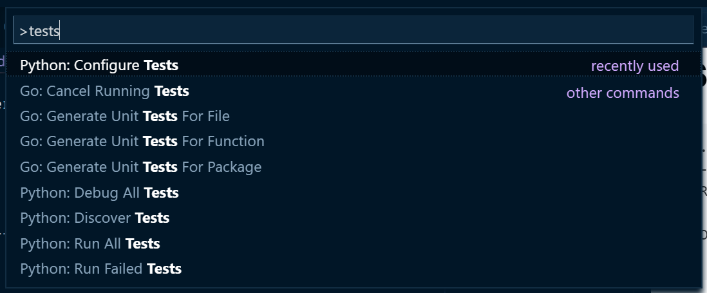
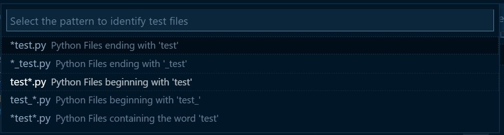
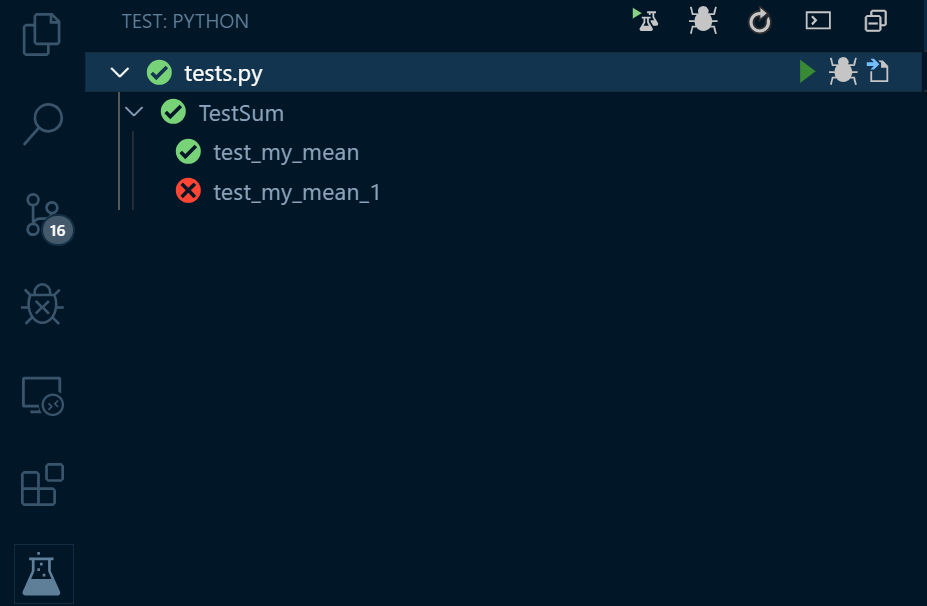

# Testing in Python


**Testing in Python is a huge topic!!!**

## Automated vs. Manual Testing

---

### Manual

- **exploratory testing**

  - No plan
  - King of manual tesing

---

### Automated testing

#### Unit Tests vs. Integration Tests

- **Untegration testing** - Testing multiple components in a chain (together)
- **Unit testing** - Testing singe component (single unit of code)

---

## Test Runners

- unittest
- nose or nose2
- pytest

### Unittests

**_Unittest_** has been built into the Python standard library since version 2.1.

- Consists of test steps (test cases)
- Consists of test assertions
    - Tests are grouped as methods in Classes
    - Use a series of special assertion methods 

#### Example

```python
# No need to pip install ...
import unittest


class TestSum(unittest.TestCase):

    def test_sum(self):
        self.assertEqual(sum([1, 2, 3]), 6, "Should be 6")

    def test_sum_tuple(self):
        self.assertEqual(sum((1, 2, 2)), 6, "Should be 6")

if __name__ == '__main__':
    unittest.main()
```

### Nose2

**nose** is compatible with any tests written using the unittest framework and can be used as a drop-in replacement for the unittest test runner.

#### Install it

```shell
pip install nose2
```

### pytest

**_pytest_** supports execution of unittest test cases.

---

## Assertions

| Assertion               |       Equivalent |
| :---------------------- | ---------------: |
| .assertEqual(a, b)      |           a == b |
| .assertTrue(x)          |  bool(x) is True |
| .assertFalse(x)         | bool(x) is False |
| .assertIs(a, b)         |           a is b |
| .assertIsNone(x)        |        x is None |
| .assertIn(a, b)         |           a in b |
| .assertIsInstance(a, b) | isinstance(a, b) |

## Run tests

```bash
python -m unittest test
# or
python -m unittest discover # discover and run test*.py in current directory
```

## Success output

```sh
..
----------------------------------------------------------------------
Ran 2 tests in 0.001s

OK

```

## Fail output

```sh
.F
======================================================================
FAIL: test_my_mean_1 (tests.TestSum)
----------------------------------------------------------------------
Traceback (most recent call last):
  File "D:\projects\_BELGIPRO\testing\tests.py", line 20, in test_my_mean_1
    self.assertEqual(result, 2)
AssertionError: 0.0 != 2

----------------------------------------------------------------------
Ran 2 tests in 0.001s

FAILED (failures=1)

```

## Running tests from VSCode

press `Ctrl`+`Shift`+`P` and type `tests`



Choose `Python: Configure Tests`
Type and choose `unittest`

Choose test directory. In my case `testing`

Chhose test files pattern. In my case `test*.py`


'Test' icon is now on your left pannel

Now you can run, debug all your tests


## Handling Expected Failures

What if we are waiting for the failue or error?

```python
class TestMean(unittest.TestCase):
    # Other tests...
    def test_on_empty(self):
        data = []
        with self.assertRaises(ZeroDivisionError):
            result = my_mean(data)
```


## Side effects

*Executing a piece of code will change the environment:* 

    - the attribute of a class
    - a file on the filesystem
    - value in a database
    - ...

*How to prevent (mitigate)*

    - Refactor to follow SRP
    - Mock
    - ...

## Mock

[unittest.mock (on python.org)](https://docs.python.org/3/library/unittest.mock.html#module-unittest.mock)
